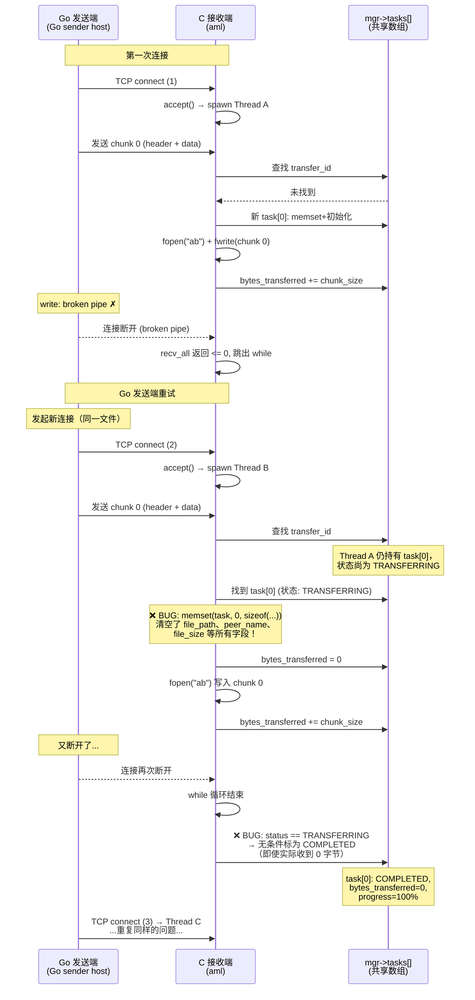

# Known Receiver Issues / 接收端已知问题

> 本图描述两个历史缺陷的触发时序：`memset` 覆盖任务槽位、以及连接断开时把
> `TRANSFERRING` 无条件标为 `COMPLETED`。这两个问题已在 `src/transfer.c` 中修复；
> 保留此图用于说明历史上为什么会产生损坏文件。
>
> 状态：已修复 | Status: Fixed

```mermaid
sequenceDiagram
    participant GoSender as Go 发送端<br>(Go sender host)
    participant CReceiver as C 接收端<br>(aml)
    participant TaskSlot as mgr->tasks[]<br>(共享数组)
    
    Note over GoSender,CReceiver: 第一次连接
    GoSender->>CReceiver: TCP connect (1)
    CReceiver->>CReceiver: accept() → spawn Thread A
    GoSender->>CReceiver: 发送 chunk 0 (header + data)
    CReceiver->>TaskSlot: 查找 transfer_id
    TaskSlot-->>CReceiver: 未找到
    CReceiver->>TaskSlot: 新 task[0]: memset+初始化
    CReceiver->>CReceiver: fopen("ab") + fwrite(chunk 0)
    CReceiver->>TaskSlot: bytes_transferred += chunk_size
    
    Note over GoSender: write: broken pipe ✗
    GoSender-->>CReceiver: 连接断开 (broken pipe)
    CReceiver->>CReceiver: recv_all 返回 <= 0, 跳出 while
    
    Note over GoSender,CReceiver: Go 发送端重试
    Note over GoSender: 发起新连接（同一文件）
    
    GoSender->>CReceiver: TCP connect (2)
    CReceiver->>CReceiver: accept() → spawn Thread B
    GoSender->>CReceiver: 发送 chunk 0 (header + data)
    CReceiver->>TaskSlot: 查找 transfer_id
    
    Note over TaskSlot: Thread A 仍持有 task[0]，<br>状态尚为 TRANSFERRING
    
    CReceiver->>TaskSlot: 找到 task[0] (状态: TRANSFERRING)
    
    Note over CReceiver: ❌ BUG: memset(task, 0, sizeof(...))<br>清空了 file_path、peer_name、<br>file_size 等所有字段！
    
    CReceiver->>TaskSlot: bytes_transferred = 0
    CReceiver->>CReceiver: fopen("ab") 写入 chunk 0
    CReceiver->>TaskSlot: bytes_transferred += chunk_size
    
    Note over GoSender: 又断开了...
    GoSender-->>CReceiver: 连接再次断开
    
    CReceiver->>CReceiver: while 循环结束
    CReceiver->>TaskSlot: ❌ BUG: status == TRANSFERRING<br>→ 无条件标为 COMPLETED<br>（即使实际收到 0 字节）
    
    Note over TaskSlot: task[0]: COMPLETED,<br>bytes_transferred=0,<br>progress=100%
    
    GoSender->>CReceiver: TCP connect (3) → Thread C<br>...重复同样的问题...
```
